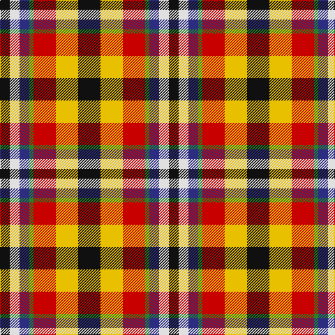

The parent of this is [Eusa](/tartans/k/14/ln14/db14/g6/r32/y32/k/32/)

This was sourced from register-of-tartans.  It is a [7 stripes tartan](/stripes/stripes7/).

Original link https://www.tartanregister.gov.uk/tartanDetails.aspx?ref=10236

## Thread count
K/14 LN14 DB14 G6 R32 Y32 K/32

## Palette
Each colour and its ΔE from the base-6 reference it is a variant of.

| Colour | Shade | Base | ΔE (OKLab) |
|---|---|---|---|
| DB |  `#2C2C80` | B  | 0.05 |
| G |  `#288028` | G  | 0.09 |
| K |  `#101010` | K  | 0.17 |
| LN |  `#E0E0E0` | W  | 0.06 |
| R |  `#C80000` | R  | 0.00 |
| Y |  `#E8C000` | Y  | 0.00 |

# Sample pattern

ID: /variants/k/14/ln14/db14/g6/r32/y32/k/32-db2c2c80-g288028-k101010-lne0e0e0-rc80000-ye8c000/
