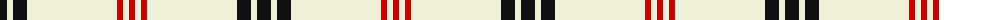

The parent of this is [White Stripes (Corporate)](/tartans/k/14/ly6/k14/ly90/r6/ly6/r/6/)

This was sourced from tartans-authority.  It is a [7 stripes tartan](/stripes/stripes7/).

Original link http://www.tartansauthority.com/tartan-ferret/display/7461/

## Thread count
K/14 LY6 K14 LY90 R6 LY6 R/6

## Palette
Each colour and its ΔE from the base-6 reference it is a variant of.

| Colour | Shade | Base | ΔE (OKLab) |
|---|---|---|---|
| K |  `#101010` | K  | 0.17 |
| LY |  `#F0F0D8` | W  | 0.03 |
| R |  `#C80000` | R  | 0.00 |

# Sample pattern

ID: /variants/k/14/ly6/k14/ly90/r6/ly6/r/6-k101010-lyf0f0d8-rc80000/
