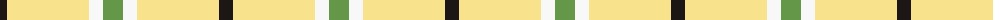
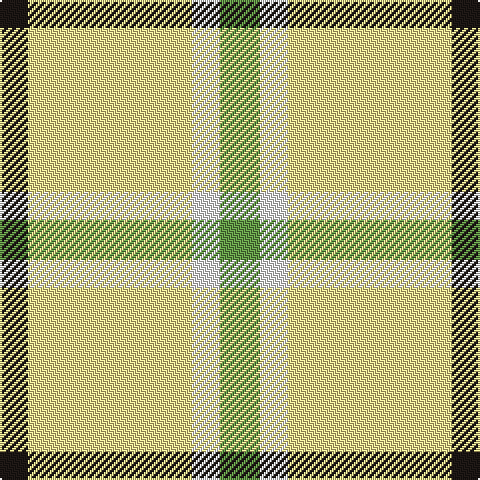

The parent of this is [Hogan (2014)](/tartans/k/14/ly82/w14/lg/20/)

This was sourced from register-of-tartans.  It is a [4 stripes tartan](/stripes/stripes4/).

Original link https://www.tartanregister.gov.uk/tartanDetails.aspx?ref=11107

## Thread count
K/14 LY82 W14 LG/20

## Palette
Each colour and its ΔE from the base-6 reference it is a variant of.

| Colour | Shade | Base | ΔE (OKLab) |
|---|---|---|---|
| K |  `#1C1714` | K  | 0.21 |
| LG |  `#649848` | G  | 0.19 |
| LY |  `#F8E38C` | Y  | 0.11 |
| W |  `#F8F8F8` | W  | 0.01 |

# Sample pattern

ID: /variants/k/14/ly82/w14/lg/20-k1c1714-lg649848-lyf8e38c-wf8f8f8/
