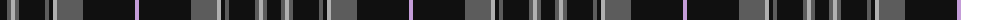

The parent of this is [Pride of Scotland Platinum Fashion Tartan Tartan Number: 6850. Earliest known date: 01/01/2006 ONLY FOR DISPLAY PURPOSE. Design owned by McCalls of Aberdeen and woven exclusively by Lochcarron of Scotland. See products available Copyright © Blair Urquhart, Comrie, 2015](/tartans/k/14/n4/na4/n4/k26/n4/k4/na4/n26/k52/lp/4/)

This was sourced from house-of-tartan.  It is a [11 stripes tartan](/stripes/stripes11/).

Original link http://www.house-of-tartan.scotland.net/house/TartanViewjs.asp?colr=Def&tnam=6850

## Thread count
K/14 N4 Na4 N4 K26 N4 K4 Na4 N26 K52 LP/4

## Palette
Each colour and its ΔE from the base-6 reference it is a variant of.

| Colour | Shade | Base | ΔE (OKLab) |
|---|---|---|---|
| K |  `#101010` | K  | 0.17 |
| LN |  `#E0E0E0` | W  | 0.06 |
| LP |  `#C49CD8` | W  | 0.24 |
| N |  `#5C5C5C` | B  | 0.14 |
| Na |  `#B0B0B0` | Y  | 0.18 |

ID: /variants/k/14/n4/na4/n4/k26/n4/k4/na4/n26/k52/lp/4-k101010-lne0e0e0-lpc49cd8-n5c5c5c-nab0b0b0/
