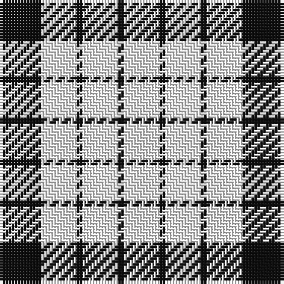

The parent of this is [Wallace Dress](/tartans/k/14/w12/k2/w12/k2/w/12/)

This was sourced from register-of-tartans.  It is a [6 stripes tartan](/stripes/stripes6/).

Original link https://www.tartanregister.gov.uk/tartanDetails.aspx?ref=4485

## Thread count
K/14 W12 K2 W12 K2 W/12

## Palette
Each colour and its ΔE from the base-6 reference it is a variant of.

| Colour | Shade | Base | ΔE (OKLab) |
|---|---|---|---|
| K |  `#101010` | K  | 0.17 |
| W |  `#FCFCFC` | W  | 0.03 |

# Sample pattern

ID: /variants/k/14/w12/k2/w12/k2/w/12-k101010-wfcfcfc/
