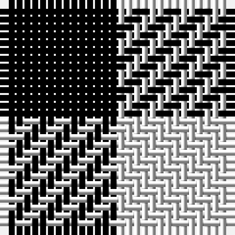

The parent of this is [Shepherd](/tartans/k/15/ln/15/)

This was sourced from weddslist.  It is a [2 stripes tartan](/stripes/stripes2/).

Original link http://www.weddslist.com/cgi-bin/tartans/pg.pl?source=sts

## Thread count
K/15 LN/15

## Palette
K LN

# Sample pattern

ID: /variants/k/15/ln/15-k000000-lne0e0e0/
