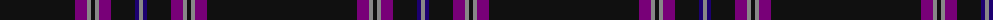

The parent of this is [Clan Inebriated (Corporate)](/tartans/k/150/p12/n4/k4/n4/p12/k24/db4/n/4/)

This was sourced from tartans-authority.  It is a [9 stripes tartan](/stripes/stripes9/).

Original link http://www.tartansauthority.com/tartan-ferret/display/7692/

## Thread count
K/150 P12 N4 K4 N4 P12 K24 DB4 N/4

## Palette
Each colour and its ΔE from the base-6 reference it is a variant of.

| Colour | Shade | Base | ΔE (OKLab) |
|---|---|---|---|
| DB |  `#1C0070` | B  | 0.14 |
| K |  `#101010` | K  | 0.17 |
| N |  `#888888` | R  | 0.24 |
| P |  `#780078` | B  | 0.16 |

ID: /variants/k/150/p12/n4/k4/n4/p12/k24/db4/n/4-db1c0070-k101010-n888888-p780078/
