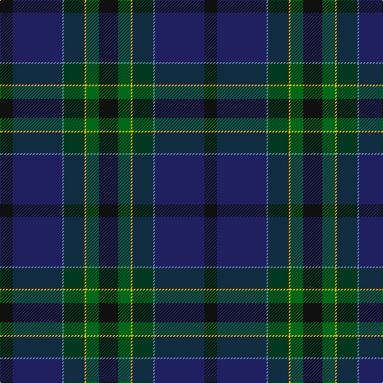

The parent of this is [Chesters, Eric (Personal)](/tartans/k/16/db62/b2/dg26/y2/g16/k/24/)

This was sourced from tartans-authority.  It is a [7 stripes tartan](/stripes/stripes7/).

Original link http://www.tartansauthority.com/tartan-ferret/display/11018/

## Thread count
K/16 DB62 B2 DG26 Y2 G16 K/24

## Palette
Each colour and its ΔE from the base-6 reference it is a variant of.

| Colour | Shade | Base | ΔE (OKLab) |
|---|---|---|---|
| B |  `#5C8CA8` | B  | 0.23 |
| DB |  `#202060` | B  | 0.11 |
| DG |  `#003820` | G  | 0.16 |
| G |  `#006818` | G  | 0.02 |
| K |  `#101010` | K  | 0.17 |
| Y |  `#E8C000` | Y  | 0.00 |

# Sample pattern

ID: /variants/k/16/db62/b2/dg26/y2/g16/k/24-b5c8ca8-db202060-dg003820-g006818-k101010-ye8c000/
