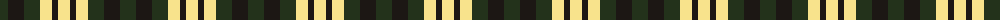
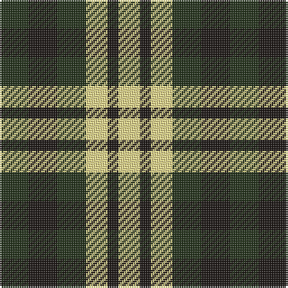

The parent of this is [Hage-West (Personal)](/tartans/k/16/ka16/k16/ly12/ka6/ly/12/)

This was sourced from register-of-tartans.  It is a [6 stripes tartan](/stripes/stripes6/).

Original link https://www.tartanregister.gov.uk/tartanDetails.aspx?ref=10845

## Thread count
K/16 Ka16 K16 LY12 Ka6 LY/12

## Palette
Each colour and its ΔE from the base-6 reference it is a variant of.

| Colour | Shade | Base | ΔE (OKLab) |
|---|---|---|---|
| K |  `#23321B` | G  | 0.17 |
| Ka |  `#1C1714` | K  | 0.21 |
| LY |  `#F8E38C` | Y  | 0.11 |

# Sample pattern

ID: /variants/k/16/ka16/k16/ly12/ka6/ly/12-k23321b-ka1c1714-lyf8e38c/
