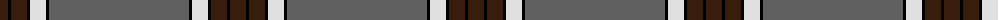
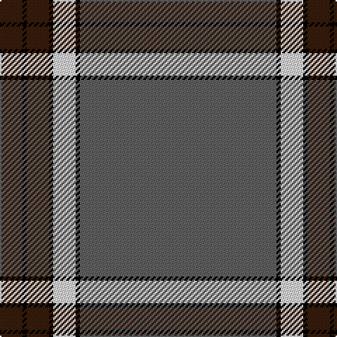

The parent of this is [Crail](/tartans/k/16/ka3/k16/ka3/ln16/ka3/n/140/)

This was sourced from register-of-tartans.  It is a [7 stripes tartan](/stripes/stripes7/).

Original link https://www.tartanregister.gov.uk/tartanDetails.aspx?ref=790

## Thread count
K/16 Ka3 K16 Ka3 LN16 Ka3 N/140

## Palette
Each colour and its ΔE from the base-6 reference it is a variant of.

| Colour | Shade | Base | ΔE (OKLab) |
|---|---|---|---|
| K |  `#381C0C` | B  | 0.21 |
| Ka |  `#000000` | K  | 0.00 |
| LN |  `#E0E0E0` | W  | 0.06 |
| N |  `#606060` | B  | 0.15 |

# Sample pattern

ID: /variants/k/16/ka3/k16/ka3/ln16/ka3/n/140-k381c0c-ka000000-lne0e0e0-n606060/
