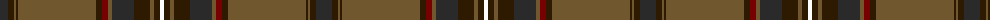

The parent of this is [Afghanistan Memorial](/tartans/k/16/ka6/g2/ka2/g78/ka6/dr6/g4/k22/ka16/g4/ka6/w/4/)

This was sourced from register-of-tartans.  It is a [13 stripes tartan](/stripes/stripes13/).

Original link https://www.tartanregister.gov.uk/tartanDetails.aspx?ref=10425

## Thread count
K/16 Ka6 G2 Ka2 G78 Ka6 DR6 G4 K22 Ka16 G4 Ka6 W/4

## Palette
Each colour and its ΔE from the base-6 reference it is a variant of.

| Colour | Shade | Base | ΔE (OKLab) |
|---|---|---|---|
| DR |  `#770101` | R  | 0.18 |
| G |  `#70572E` | G  | 0.14 |
| K |  `#2A2A2A` | B  | 0.16 |
| Ka |  `#2E1A01` | B  | 0.23 |
| W |  `#FFFFFF` | W  | 0.03 |

ID: /variants/k/16/ka6/g2/ka2/g78/ka6/dr6/g4/k22/ka16/g4/ka6/w/4-dr770101-g70572e-k2a2a2a-ka2e1a01-wffffff/
