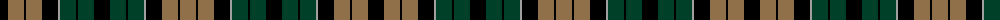

The parent of this is [Sackett](/tartans/k/16/lt16/k2/lt16/k16/n2/dg16/k2/dg16/k16/dg16/k2/dg16/n2/k16/lt16/k2/lt/16/)

This was sourced from register-of-tartans.  It is a [18 stripes tartan](/stripes/stripes18/).

Original link https://www.tartanregister.gov.uk/tartanDetails.aspx?ref=3634

## Thread count
K/16 LT16 K2 LT16 K16 N2 DG16 K2 DG16 K16 DG16 K2 DG16 N2 K16 LT16 K2 LT/16

## Palette
Each colour and its ΔE from the base-6 reference it is a variant of.

| Colour | Shade | Base | ΔE (OKLab) |
|---|---|---|---|
| DG |  `#004028` | G  | 0.14 |
| G |  `#289C18` | G  | 0.18 |
| K |  `#000000` | K  | 0.00 |
| LT |  `#907048` | R  | 0.18 |
| N |  `#A0A0A0` | Y  | 0.20 |
| W |  `#FCFCFC` | W  | 0.03 |

ID: /variants/k/16/lt16/k2/lt16/k16/n2/dg16/k2/dg16/k16/dg16/k2/dg16/n2/k16/lt16/k2/lt/16-dg004028-g289c18-k000000-lt907048-na0a0a0-wfcfcfc/
