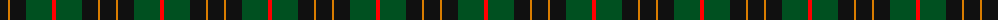
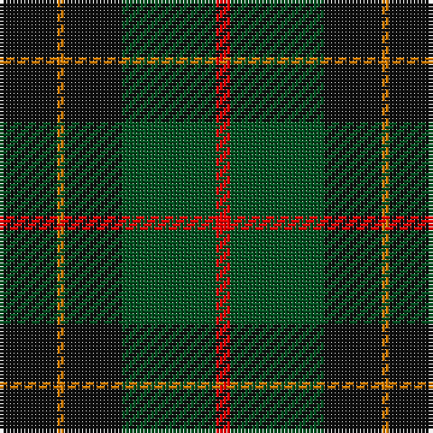

The parent of this is [Tolmie](/tartans/k/16/o2/k16/g26/r/4/)

This was sourced from register-of-tartans.  It is a [5 stripes tartan](/stripes/stripes5/).

Original link https://www.tartanregister.gov.uk/tartanDetails.aspx?ref=11581

## Thread count
K/16 O2 K16 G26 R/4

## Palette
Each colour and its ΔE from the base-6 reference it is a variant of.

| Colour | Shade | Base | ΔE (OKLab) |
|---|---|---|---|
| G |  `#005020` | G  | 0.08 |
| K |  `#101010` | K  | 0.17 |
| O |  `#D87C00` | Y  | 0.17 |
| R |  `#FF0000` | R  | 0.11 |

# Sample pattern

ID: /variants/k/16/o2/k16/g26/r/4-g005020-k101010-od87c00-rff0000/
