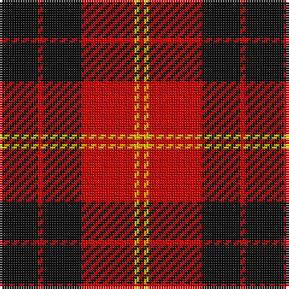

The parent of this is [Swanstrom (Personal)](/tartans/k/16/r2/k16/r22/y2/r/2/)

This was sourced from tartans-authority.  It is a [6 stripes tartan](/stripes/stripes6/).

Original link http://www.tartansauthority.com/tartan-ferret/display/7222/

## Thread count
K/16 R2 K16 R22 Y2 R/2

## Palette
Each colour and its ΔE from the base-6 reference it is a variant of.

| Colour | Shade | Base | ΔE (OKLab) |
|---|---|---|---|
| K |  `#101010` | K  | 0.17 |
| R |  `#C80000` | R  | 0.00 |
| Y |  `#E8C000` | Y  | 0.00 |

# Sample pattern

ID: /variants/k/16/r2/k16/r22/y2/r/2-k101010-rc80000-ye8c000/
