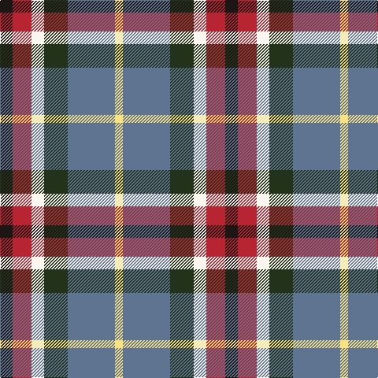

The parent of this is [Reekie (Edmonton)](/tartans/k/16/r24/w16/ka30/b60/ly/10/)

This was sourced from register-of-tartans.  It is a [6 stripes tartan](/stripes/stripes6/).

Original link https://www.tartanregister.gov.uk/tartanDetails.aspx?ref=10279

## Thread count
K/16 R24 W16 Ka30 B60 LY/10

## Palette
Each colour and its ΔE from the base-6 reference it is a variant of.

| Colour | Shade | Base | ΔE (OKLab) |
|---|---|---|---|
| B |  `#5F7490` | B  | 0.17 |
| K |  `#1C1714` | K  | 0.21 |
| Ka |  `#23321B` | G  | 0.17 |
| LY |  `#F8E380` | Y  | 0.10 |
| R |  `#B62531` | R  | 0.04 |
| W |  `#F9F5EF` | W  | 0.01 |

# Sample pattern

ID: /variants/k/16/r24/w16/ka30/b60/ly/10-b5f7490-k1c1714-ka23321b-lyf8e380-rb62531-wf9f5ef/
