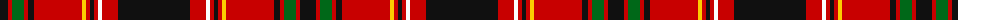

The parent of this is [MacKeever (Personal)](/tartans/k/16/r4/g12/r4/k6/r48/y4/r4/k4/r4/w4/r16/k/72/)

This was sourced from tartans-authority.  It is a [13 stripes tartan](/stripes/stripes13/).

Original link http://www.tartansauthority.com/tartan-ferret/display/8426/

## Thread count
K/16 R4 G12 R4 K6 R48 Y4 R4 K4 R4 W4 R16 K/72

## Palette
Each colour and its ΔE from the base-6 reference it is a variant of.

| Colour | Shade | Base | ΔE (OKLab) |
|---|---|---|---|
| G |  `#006818` | G  | 0.02 |
| K |  `#101010` | K  | 0.17 |
| R |  `#C80000` | R  | 0.00 |
| W |  `#FCFCFC` | W  | 0.03 |
| Y |  `#FCCC00` | Y  | 0.04 |

ID: /variants/k/16/r4/g12/r4/k6/r48/y4/r4/k4/r4/w4/r16/k/72-g006818-k101010-rc80000-wfcfcfc-yfccc00/
