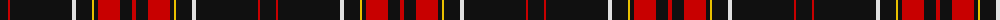

The parent of this is [Field Marshall Montgomery PB (Corp)](/tartans/k/16/ra2/k62/ln4/kb16/y2/kb4/r2/ra20/ka12/r/4/)

This was sourced from tartans-authority.  It is a [11 stripes tartan](/stripes/stripes11/).

Original link http://www.tartansauthority.com/tartan-ferret/display/8118/

## Thread count
K/16 Ra2 K62 LN4 Kb16 Y2 Kb4 R2 Ra20 Ka12 R/4

## Palette
Each colour and its ΔE from the base-6 reference it is a variant of.

| Colour | Shade | Base | ΔE (OKLab) |
|---|---|---|---|
| K |  `#101010` | K  | 0.17 |
| Ka |  `#101010` | K  | 0.17 |
| Kb |  `#101010` | K  | 0.17 |
| LN |  `#E0E0E0` | W  | 0.06 |
| R |  `#C80000` | R  | 0.00 |
| Ra |  `#C80000` | R  | 0.00 |
| Y |  `#E8C000` | Y  | 0.00 |

ID: /variants/k/16/ra2/k62/ln4/kb16/y2/kb4/r2/ra20/ka12/r/4-k101010-ka101010-kb101010-lne0e0e0-rc80000-rac80000-ye8c000/
