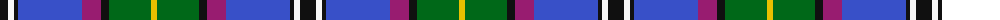

The parent of this is [Unidentified (Woven sample)](/tartans/k/16/w6/k4/b64/p19/k8/g42/y/6/)

This was sourced from tartans-authority.  It is a [8 stripes tartan](/stripes/stripes8/).

Original link http://www.tartansauthority.com/tartan-ferret/display/5938/

## Thread count
K/16 W6 K4 B64 P19 K8 G42 Y/6

## Palette
Each colour and its ΔE from the base-6 reference it is a variant of.

| Colour | Shade | Base | ΔE (OKLab) |
|---|---|---|---|
| B |  `#3850C8` | B  | 0.12 |
| G |  `#006818` | G  | 0.02 |
| K |  `#101010` | K  | 0.17 |
| P |  `#981C70` | R  | 0.16 |
| W |  `#F8F8F8` | W  | 0.01 |
| Y |  `#E8C000` | Y  | 0.00 |

# Sample pattern

ID: /variants/k/16/w6/k4/b64/p19/k8/g42/y/6-b3850c8-g006818-k101010-p981c70-wf8f8f8-ye8c000/
