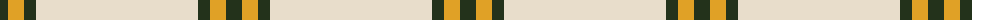

The parent of this is [Young in Australia](/tartans/k/16/y16/k12/w/162/)

This was sourced from register-of-tartans.  It is a [4 stripes tartan](/stripes/stripes4/).

Original link https://www.tartanregister.gov.uk/tartanDetails.aspx?ref=10241

## Thread count
K/16 Y16 K12 W/162

## Palette
Each colour and its ΔE from the base-6 reference it is a variant of.

| Colour | Shade | Base | ΔE (OKLab) |
|---|---|---|---|
| K |  `#23321B` | G  | 0.17 |
| W |  `#E8DDCB` | W  | 0.07 |
| Y |  `#E0A126` | Y  | 0.08 |

# Sample pattern

ID: /variants/k/16/y16/k12/w/162-k23321b-we8ddcb-ye0a126/
