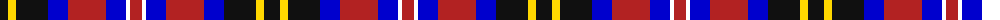
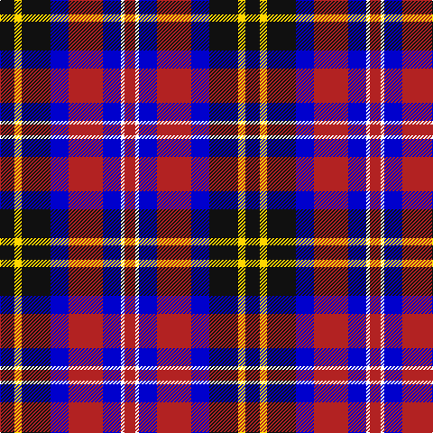

The parent of this is [Sullivan of Braemar](/tartans/k/16/y8/k32/b20/r38/b20/w4/r/12/)

This was sourced from register-of-tartans.  It is a [8 stripes tartan](/stripes/stripes8/).

Original link https://www.tartanregister.gov.uk/tartanDetails.aspx?ref=10049

## Thread count
K/16 Y8 K32 B20 R38 B20 W4 R/12

## Palette
Each colour and its ΔE from the base-6 reference it is a variant of.

| Colour | Shade | Base | ΔE (OKLab) |
|---|---|---|---|
| B |  `#0000CD` | B  | 0.15 |
| K |  `#101010` | K  | 0.17 |
| R |  `#B22222` | R  | 0.04 |
| W |  `#FFFFFF` | W  | 0.03 |
| Y |  `#FFD700` | Y  | 0.07 |

# Sample pattern

ID: /variants/k/16/y8/k32/b20/r38/b20/w4/r/12-b0000cd-k101010-rb22222-wffffff-yffd700/
