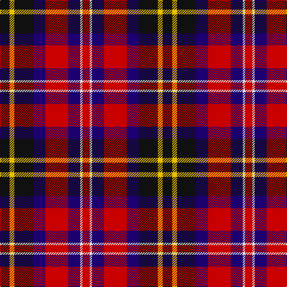

The parent of this is [Sullivan of Braemar (Personal)](/tartans/k/16/y8/k32/db20/r38/db20/ln4/r/12/)

This was sourced from tartans-authority.  It is a [8 stripes tartan](/stripes/stripes8/).

Original link http://www.tartansauthority.com/tartan-ferret/display/10049/

## Thread count
K/16 Y8 K32 DB20 R38 DB20 LN4 R/12

## Palette
Each colour and its ΔE from the base-6 reference it is a variant of.

| Colour | Shade | Base | ΔE (OKLab) |
|---|---|---|---|
| DB |  `#1C0070` | B  | 0.14 |
| K |  `#101010` | K  | 0.17 |
| LN |  `#E0E0E0` | W  | 0.06 |
| R |  `#C80000` | R  | 0.00 |
| Y |  `#E8C000` | Y  | 0.00 |

# Sample pattern

ID: /variants/k/16/y8/k32/db20/r38/db20/ln4/r/12-db1c0070-k101010-lne0e0e0-rc80000-ye8c000/
