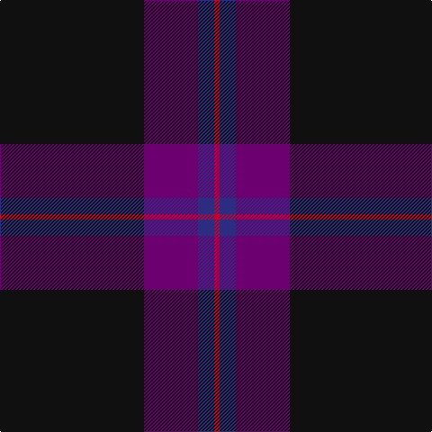

The parent of this is [Doyle, Blue (Fashion)](/tartans/k/160/p60/db18/r/6/)

This was sourced from tartans-authority.  It is a [4 stripes tartan](/stripes/stripes4/).

Original link http://www.tartansauthority.com/tartan-ferret/display/6021/

## Thread count
K/160 P60 DB18 R/6

## Palette
Each colour and its ΔE from the base-6 reference it is a variant of.

| Colour | Shade | Base | ΔE (OKLab) |
|---|---|---|---|
| DB |  `#2C2C80` | B  | 0.05 |
| K |  `#101010` | K  | 0.17 |
| P |  `#6C0070` | B  | 0.15 |
| R |  `#C8002C` | R  | 0.03 |

# Sample pattern

ID: /variants/k/160/p60/db18/r/6-db2c2c80-k101010-p6c0070-rc8002c/
