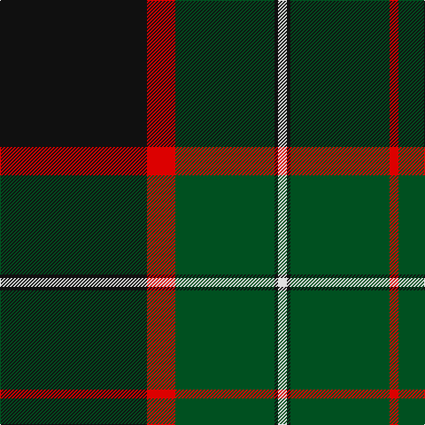

The parent of this is [MacDiarmid #2](/tartans/k/166/r32/g112/k4/ln10/k4/g112/r/10/)

This was sourced from register-of-tartans.  It is a [8 stripes tartan](/stripes/stripes8/).

Original link https://www.tartanregister.gov.uk/tartanDetails.aspx?ref=2330

## Thread count
K/166 R32 G112 K4 LN10 K4 G112 R/10

## Palette
Each colour and its ΔE from the base-6 reference it is a variant of.

| Colour | Shade | Base | ΔE (OKLab) |
|---|---|---|---|
| G |  `#005020` | G  | 0.08 |
| K |  `#101010` | K  | 0.17 |
| LN |  `#E0E0E0` | W  | 0.06 |
| R |  `#DC0000` | R  | 0.04 |

# Sample pattern

ID: /variants/k/166/r32/g112/k4/ln10/k4/g112/r/10-g005020-k101010-lne0e0e0-rdc0000/
