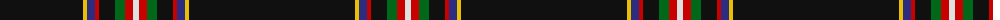

The parent of this is [Spirit of Lanarkshire (Corporate)](/tartans/k/166/y4/db8/r4/k16/g10/r8/ln/6/)

This was sourced from tartans-authority.  It is a [8 stripes tartan](/stripes/stripes8/).

Original link http://www.tartansauthority.com/tartan-ferret/display/6587/

## Thread count
K/166 Y4 DB8 R4 K16 G10 R8 LN/6

## Palette
Each colour and its ΔE from the base-6 reference it is a variant of.

| Colour | Shade | Base | ΔE (OKLab) |
|---|---|---|---|
| DB |  `#2C2C80` | B  | 0.05 |
| G |  `#006818` | G  | 0.02 |
| K |  `#101010` | K  | 0.17 |
| LN |  `#E0E0E0` | W  | 0.06 |
| R |  `#C80000` | R  | 0.00 |
| Y |  `#E8C000` | Y  | 0.00 |

# Sample pattern

ID: /variants/k/166/y4/db8/r4/k16/g10/r8/ln/6-db2c2c80-g006818-k101010-lne0e0e0-rc80000-ye8c000/
