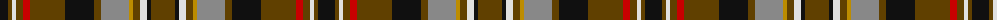

The parent of this is [Mauchline](/tartans/k/17/t4/ln4/t7/r7/t35/k29/t7/n28/dy4/t7/ln7/k4/t/24/)

This was sourced from tartans-authority.  It is a [14 stripes tartan](/stripes/stripes14/).

Original link http://www.tartansauthority.com/tartan-ferret/display/8384/

## Thread count
K/17 T4 LN4 T7 R7 T35 K29 T7 N28 DY4 T7 LN7 K4 T/24

## Palette
Each colour and its ΔE from the base-6 reference it is a variant of.

| Colour | Shade | Base | ΔE (OKLab) |
|---|---|---|---|
| DY |  `#BC8C00` | Y  | 0.16 |
| K |  `#101010` | K  | 0.17 |
| LN |  `#E0E0E0` | W  | 0.06 |
| N |  `#888888` | R  | 0.24 |
| R |  `#C80000` | R  | 0.00 |
| T |  `#604000` | G  | 0.14 |

ID: /variants/k/17/t4/ln4/t7/r7/t35/k29/t7/n28/dy4/t7/ln7/k4/t/24-dybc8c00-k101010-lne0e0e0-n888888-rc80000-t604000/
