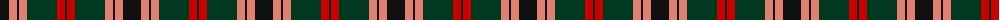
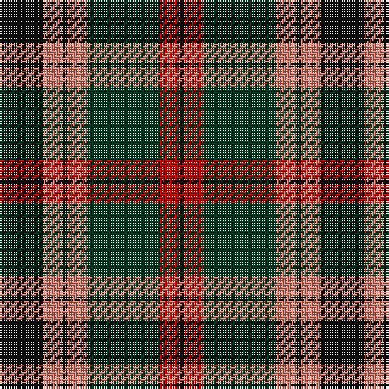

The parent of this is [Logan - 1797 (Dark)](/tartans/k/18/lr8/k2/lr8/dg30/r8/k/2/)

This was sourced from tartans-authority.  It is a [7 stripes tartan](/stripes/stripes7/).

Original link http://www.tartansauthority.com/tartan-ferret/display/1150/

## Thread count
K/18 LR8 K2 LR8 DG30 R8 K/2

## Palette
Each colour and its ΔE from the base-6 reference it is a variant of.

| Colour | Shade | Base | ΔE (OKLab) |
|---|---|---|---|
| DG |  `#003820` | G  | 0.16 |
| K |  `#101010` | K  | 0.17 |
| LR |  `#E08070` | Y  | 0.20 |
| R |  `#C80000` | R  | 0.00 |

# Sample pattern

ID: /variants/k/18/lr8/k2/lr8/dg30/r8/k/2-dg003820-k101010-lre08070-rc80000/
