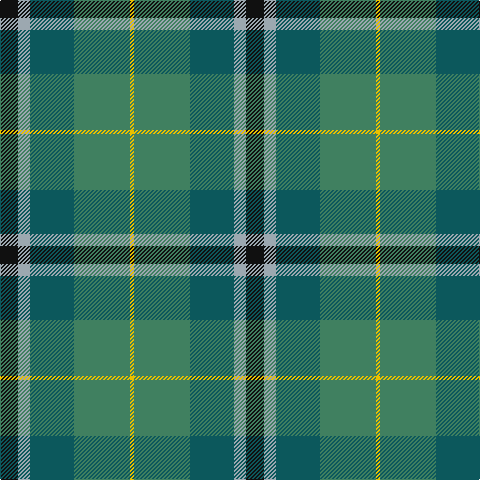

The parent of this is [Wellington (Lochcarron)](/tartans/k/18/n12/g44/ga56/y/4/)

This was sourced from register-of-tartans.  It is a [5 stripes tartan](/stripes/stripes5/).

Original link https://www.tartanregister.gov.uk/tartanDetails.aspx?ref=4827

## Thread count
K/18 N12 G44 Ga56 Y/4

## Palette
Each colour and its ΔE from the base-6 reference it is a variant of.

| Colour | Shade | Base | ΔE (OKLab) |
|---|---|---|---|
| G |  `#0C585C` | B  | 0.11 |
| Ga |  `#408060` | G  | 0.13 |
| K |  `#101010` | K  | 0.17 |
| N |  `#9CA8B0` | Y  | 0.21 |
| Y |  `#E8C000` | Y  | 0.00 |

# Sample pattern

ID: /variants/k/18/n12/g44/ga56/y/4-g0c585c-ga408060-k101010-n9ca8b0-ye8c000/
