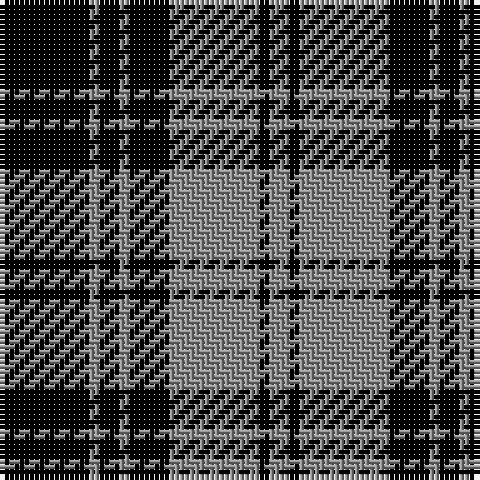

The parent of this is [Douglas, Grey Clan/Family Tartan Tartan Number: 7211. Earliest known date: 01/01/1842 The design comes from the Vestiarium Scoticum (1842). The authors, the Sobieski Stuart brothers, enjoyed a popular following among the Scottish gentry in the early Victorian era, and in the spirit of the times, added mystery, romance and some spurious historical documentation to the subject of tartan. Of the better known tartans, the book offers some minor variation, but in other cases it provides the only recorded version of many tartans in use today. (Estimated threadcount; Original STA ref: 1127) See products available Copyright © Blair Urquhart, Comrie, 2015](/tartans/k/18/n2/k4/n2/k8/n18/k2/n/4/)

This was sourced from house-of-tartan.  It is a [8 stripes tartan](/stripes/stripes8/).

Original link http://www.house-of-tartan.scotland.net/house/TartanViewjs.asp?colr=Def&tnam=7211

## Thread count
K/18 N2 K4 N2 K8 N18 K2 N/4

## Palette
Each colour and its ΔE from the base-6 reference it is a variant of.

| Colour | Shade | Base | ΔE (OKLab) |
|---|---|---|---|
| K |  `#000000` | K  | 0.00 |
| N |  `#909090` | Y  | 0.24 |

# Sample pattern

ID: /variants/k/18/n2/k4/n2/k8/n18/k2/n/4-k000000-n909090/
