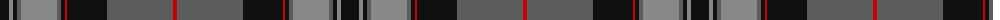

The parent of this is [Pride of Scotland Silver](/tartans/k/18/na4/k4/n4/na36/n4/k4/r2/k2/k38/n66/r/4/)

This was sourced from register-of-tartans.  It is a [12 stripes tartan](/stripes/stripes12/).

Original link https://www.tartanregister.gov.uk/tartanDetails.aspx?ref=3381

## Thread count
K/18 Na4 K4 N4 Na36 N4 K4 R2 K2 K38 N66 R/4

## Palette
Each colour and its ΔE from the base-6 reference it is a variant of.

| Colour | Shade | Base | ΔE (OKLab) |
|---|---|---|---|
| K |  `#101010` | K  | 0.17 |
| N |  `#5C5C5C` | B  | 0.14 |
| Na |  `#888888` | R  | 0.24 |
| R |  `#C80000` | R  | 0.00 |

ID: /variants/k/18/na4/k4/n4/na36/n4/k4/r2/k2/k38/n66/r/4-k101010-n5c5c5c-na888888-rc80000/
