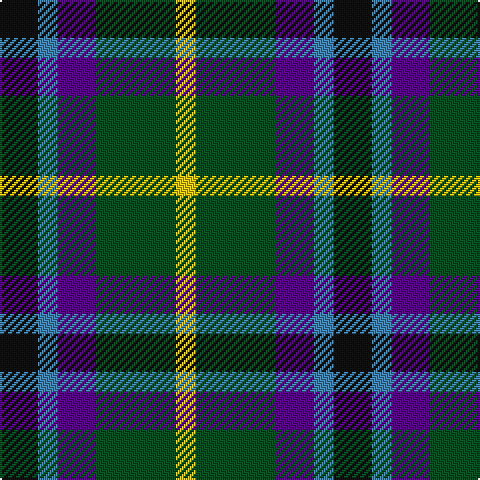

The parent of this is [Gala Water Old](/tartans/k/19/b10/p19/g40/y/10/)

This was sourced from register-of-tartans.  It is a [5 stripes tartan](/stripes/stripes5/).

Original link https://www.tartanregister.gov.uk/tartanDetails.aspx?ref=1297

## Thread count
K/19 B10 P19 G40 Y/10

## Palette
Each colour and its ΔE from the base-6 reference it is a variant of.

| Colour | Shade | Base | ΔE (OKLab) |
|---|---|---|---|
| B |  `#3C82AF` | B  | 0.20 |
| G |  `#005020` | G  | 0.08 |
| K |  `#101010` | K  | 0.17 |
| P |  `#5A008C` | B  | 0.12 |
| Y |  `#E8C000` | Y  | 0.00 |

# Sample pattern

ID: /variants/k/19/b10/p19/g40/y/10-b3c82af-g005020-k101010-p5a008c-ye8c000/
