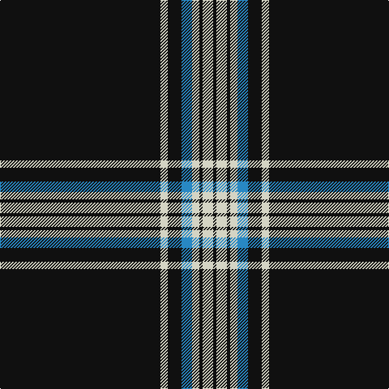

The parent of this is [London Fog Black (Fashion)](/tartans/k/198/n9/k17/b13/n9/k4/n13/k/4/)

This was sourced from tartans-authority.  It is a [8 stripes tartan](/stripes/stripes8/).

Original link http://www.tartansauthority.com/tartan-ferret/display/7313/

## Thread count
K/198 N9 K17 B13 N9 K4 N13 K/4

## Palette
Each colour and its ΔE from the base-6 reference it is a variant of.

| Colour | Shade | Base | ΔE (OKLab) |
|---|---|---|---|
| B |  `#2888C4` | B  | 0.21 |
| K |  `#101010` | K  | 0.17 |
| N |  `#D4D4C4` | W  | 0.10 |

# Sample pattern

ID: /variants/k/198/n9/k17/b13/n9/k4/n13/k/4-b2888c4-k101010-nd4d4c4/
