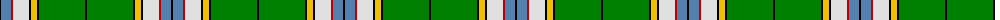

The parent of this is [Nor Westers](/tartans/k/2/b10/r2/ln16/k2/y6/k2/g46/k/2/)

This was sourced from weddslist.  It is a [9 stripes tartan](/stripes/stripes9/).

Original link http://www.weddslist.com/cgi-bin/tartans/pg.pl?source=sts

## Thread count
K/2 B10 R2 LN16 K2 Y6 K2 G46 K/2

## Palette
Each colour and its ΔE from the base-6 reference it is a variant of.

| Colour | Shade | Base | ΔE (OKLab) |
|---|---|---|---|
| B |  `#5480B0` | B  | 0.20 |
| G |  `#008000` | G  | 0.09 |
| K |  `#000000` | K  | 0.00 |
| LN |  `#E0E0E0` | W  | 0.06 |
| R |  `#C00000` | R  | 0.02 |
| Y |  `#F0C000` | Y  | 0.01 |

ID: /variants/k/2/b10/r2/ln16/k2/y6/k2/g46/k/2-b5480b0-g008000-k000000-lne0e0e0-rc00000-yf0c000/
