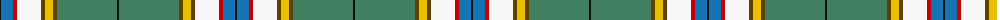

The parent of this is [Nor'Westers (District)](/tartans/k/2/b12/r4/w24/t4/y8/t4/g60/k/2/)

This was sourced from tartans-authority.  It is a [9 stripes tartan](/stripes/stripes9/).

Original link http://www.tartansauthority.com/tartan-ferret/display/1067/

## Thread count
K/2 B12 R4 W24 T4 Y8 T4 G60 K/2

## Palette
Each colour and its ΔE from the base-6 reference it is a variant of.

| Colour | Shade | Base | ΔE (OKLab) |
|---|---|---|---|
| B |  `#1474B4` | B  | 0.15 |
| G |  `#408060` | G  | 0.13 |
| K |  `#101010` | K  | 0.17 |
| R |  `#C80000` | R  | 0.00 |
| T |  `#604000` | G  | 0.14 |
| W |  `#F8F8F8` | W  | 0.01 |
| Y |  `#E8C000` | Y  | 0.00 |

ID: /variants/k/2/b12/r4/w24/t4/y8/t4/g60/k/2-b1474b4-g408060-k101010-rc80000-t604000-wf8f8f8-ye8c000/
