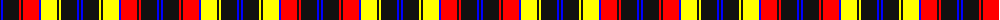

The parent of this is [Robieson QAHS](/tartans/k/2/b2/k16/r2/k2/r16/b2/y16/k2/y2/k16/b2/k/2/)

This was sourced from register-of-tartans.  It is a [13 stripes tartan](/stripes/stripes13/).

Original link https://www.tartanregister.gov.uk/tartanDetails.aspx?ref=5790

## Thread count
K/2 B2 K16 R2 K2 R16 B2 Y16 K2 Y2 K16 B2 K/2

## Palette
Each colour and its ΔE from the base-6 reference it is a variant of.

| Colour | Shade | Base | ΔE (OKLab) |
|---|---|---|---|
| B |  `#0000FF` | B  | 0.21 |
| K |  `#101010` | K  | 0.17 |
| R |  `#FF0000` | R  | 0.11 |
| Y |  `#FFFF00` | Y  | 0.16 |

ID: /variants/k/2/b2/k16/r2/k2/r16/b2/y16/k2/y2/k16/b2/k/2-b0000ff-k101010-rff0000-yffff00/
