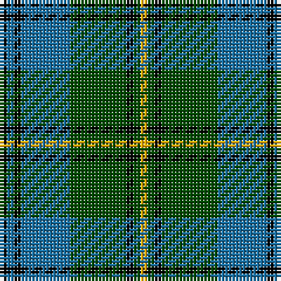

The parent of this is [Banff Centennial (Commemorative)](/tartans/k/2/b2/k2/b14/g16/k2/g2/y/2/)

This was sourced from tartans-authority.  It is a [8 stripes tartan](/stripes/stripes8/).

Original link http://www.tartansauthority.com/tartan-ferret/display/3648/

## Thread count
K/2 B2 K2 B14 G16 K2 G2 Y/2

## Palette
Each colour and its ΔE from the base-6 reference it is a variant of.

| Colour | Shade | Base | ΔE (OKLab) |
|---|---|---|---|
| B |  `#1870A4` | B  | 0.14 |
| G |  `#004C00` | G  | 0.08 |
| K |  `#000000` | K  | 0.00 |
| Y |  `#FCB000` | Y  | 0.05 |

# Sample pattern

ID: /variants/k/2/b2/k2/b14/g16/k2/g2/y/2-b1870a4-g004c00-k000000-yfcb000/
