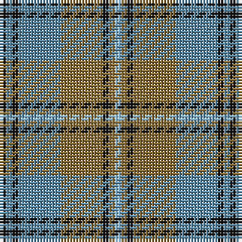

The parent of this is [Auld Lang Syne (Philip King Tailoring)](/tartans/k/2/b2/k2/b14/lt14/k2/lt2/lb/2/)

This was sourced from register-of-tartans.  It is a [8 stripes tartan](/stripes/stripes8/).

Original link https://www.tartanregister.gov.uk/tartanDetails.aspx?ref=5313

## Thread count
K/2 B2 K2 B14 LT14 K2 LT2 LB/2

## Palette
Each colour and its ΔE from the base-6 reference it is a variant of.

| Colour | Shade | Base | ΔE (OKLab) |
|---|---|---|---|
| B |  `#5C8CA8` | B  | 0.23 |
| K |  `#101010` | K  | 0.17 |
| LB |  `#98C8E8` | W  | 0.17 |
| LT |  `#8C7038` | G  | 0.18 |

# Sample pattern

ID: /variants/k/2/b2/k2/b14/lt14/k2/lt2/lb/2-b5c8ca8-k101010-lb98c8e8-lt8c7038/
