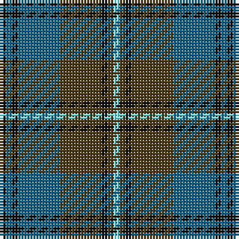

The parent of this is [Auld Lang Syne](/tartans/k/2/b2/k2/b14/t14/k2/t2/lb/2/)

This was sourced from register-of-tartans.  It is a [8 stripes tartan](/stripes/stripes8/).

Original link https://www.tartanregister.gov.uk/tartanDetails.aspx?ref=131

## Thread count
K/2 B2 K2 B14 T14 K2 T2 LB/2

## Palette
Each colour and its ΔE from the base-6 reference it is a variant of.

| Colour | Shade | Base | ΔE (OKLab) |
|---|---|---|---|
| B |  `#07648C` | B  | 0.10 |
| Ba |  `#3C82AF` | B  | 0.20 |
| K |  `#101010` | K  | 0.17 |
| LB |  `#82F5FA` | W  | 0.12 |
| T |  `#503C14` | G  | 0.15 |

# Sample pattern

ID: /variants/k/2/b2/k2/b14/t14/k2/t2/lb/2-b07648c-ba3c82af-k101010-lb82f5fa-t503c14/
