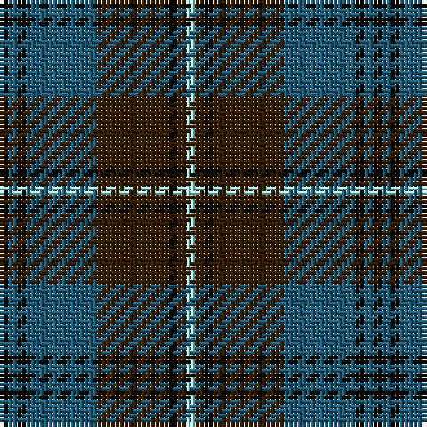

The parent of this is [Auld Lang Syne Burns Commemorative Tartan Tartan Number: 2400. Earliest known date: 01/01/2002 Launched on the 25th January at a the Beach Ballroom Aberdeen, to celebrate the birth of Robert Burns 2002./Threadcount and colours aren't 100% original. Generated manually./ See products available Copyright © Blair Urquhart, Comrie, 2015](/tartans/k/2/b2/k2/b16/ka16/k2/ka2/lb/2/)

This was sourced from house-of-tartan.  It is a [8 stripes tartan](/stripes/stripes8/).

Original link http://www.house-of-tartan.scotland.net/house/TartanViewjs.asp?colr=Def&tnam=2400

## Thread count
K/2 B2 K2 B16 Ka16 K2 Ka2 LB/2

## Palette
Each colour and its ΔE from the base-6 reference it is a variant of.

| Colour | Shade | Base | ΔE (OKLab) |
|---|---|---|---|
| B |  `#205D7A` | B  | 0.09 |
| K |  `#090700` | K  | 0.13 |
| Ka |  `#351D00` | B  | 0.22 |
| LB |  `#A7EAE1` | W  | 0.10 |

# Sample pattern

ID: /variants/k/2/b2/k2/b16/ka16/k2/ka2/lb/2-b205d7a-k090700-ka351d00-lba7eae1/
