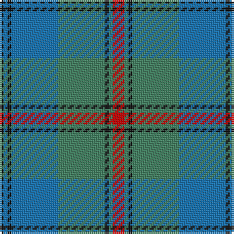

The parent of this is [Peter of Lee (Personal)](/tartans/k/2/b2/k2/b24/g24/k2/g2/r/6/)

This was sourced from tartans-authority.  It is a [8 stripes tartan](/stripes/stripes8/).

Original link http://www.tartansauthority.com/tartan-ferret/display/1055/

## Thread count
K/2 B2 K2 B24 G24 K2 G2 R/6

## Palette
Each colour and its ΔE from the base-6 reference it is a variant of.

| Colour | Shade | Base | ΔE (OKLab) |
|---|---|---|---|
| B |  `#1474B4` | B  | 0.15 |
| G |  `#408060` | G  | 0.13 |
| K |  `#101010` | K  | 0.17 |
| R |  `#C80000` | R  | 0.00 |

# Sample pattern

ID: /variants/k/2/b2/k2/b24/g24/k2/g2/r/6-b1474b4-g408060-k101010-rc80000/
