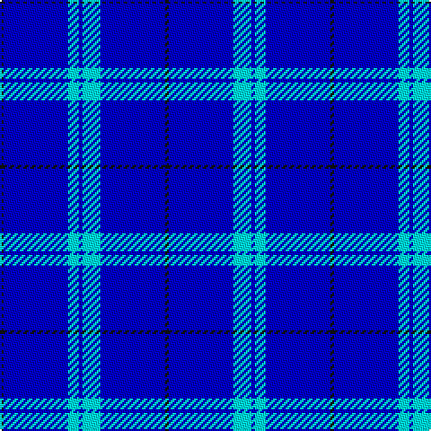

The parent of this is [Blueheart](/tartans/k/2/b36/lb6/b2/lb10/b36/k/2/)

This was sourced from register-of-tartans.  It is a [7 stripes tartan](/stripes/stripes7/).

Original link https://www.tartanregister.gov.uk/tartanDetails.aspx?ref=11405

## Thread count
K/2 B36 LB6 B2 LB10 B36 K/2

## Palette
Each colour and its ΔE from the base-6 reference it is a variant of.

| Colour | Shade | Base | ΔE (OKLab) |
|---|---|---|---|
| B |  `#0000CD` | B  | 0.15 |
| K |  `#101010` | K  | 0.17 |
| LB |  `#00FCFC` | W  | 0.17 |

# Sample pattern

ID: /variants/k/2/b36/lb6/b2/lb10/b36/k/2-b0000cd-k101010-lb00fcfc/
