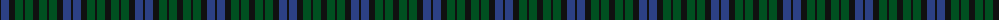

The parent of this is [Unidentified No 63](/tartans/k/2/b8/k6/g8/k2/g8/k/6/)

This was sourced from register-of-tartans.  It is a [7 stripes tartan](/stripes/stripes7/).

Original link https://www.tartanregister.gov.uk/tartanDetails.aspx?ref=4331

## Thread count
K/2 B8 K6 G8 K2 G8 K/6

## Palette
Each colour and its ΔE from the base-6 reference it is a variant of.

| Colour | Shade | Base | ΔE (OKLab) |
|---|---|---|---|
| B |  `#2C4084` | B  | 0.00 |
| G |  `#005020` | G  | 0.08 |
| K |  `#101010` | K  | 0.17 |

# Sample pattern

ID: /variants/k/2/b8/k6/g8/k2/g8/k/6-b2c4084-g005020-k101010/
