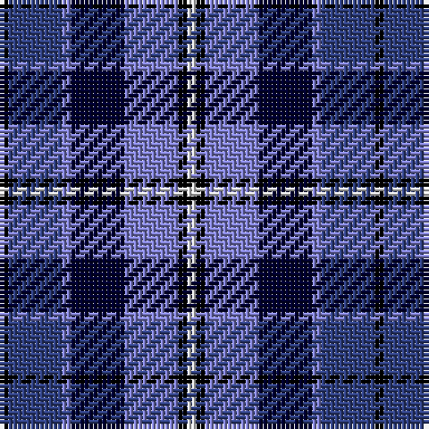

The parent of this is [Mary Washington](/tartans/k/2/ba12/b2/db12/b12/k2/ln/2/)

This was sourced from weddslist.  It is a [7 stripes tartan](/stripes/stripes7/).

Original link http://www.weddslist.com/cgi-bin/tartans/pg.pl?source=sts

## Thread count
K/2 Ba12 B2 DB12 B12 K2 LN/2

## Palette
Each colour and its ΔE from the base-6 reference it is a variant of.

| Colour | Shade | Base | ΔE (OKLab) |
|---|---|---|---|
| B |  `#8080D0` | B  | 0.24 |
| Ba |  `#304080` | B  | 0.01 |
| DB |  `#000030` | K  | 0.17 |
| K |  `#000000` | K  | 0.00 |
| LN |  `#E0E0E0` | W  | 0.06 |

# Sample pattern

ID: /variants/k/2/ba12/b2/db12/b12/k2/ln/2-b8080d0-ba304080-db000030-k000000-lne0e0e0/
