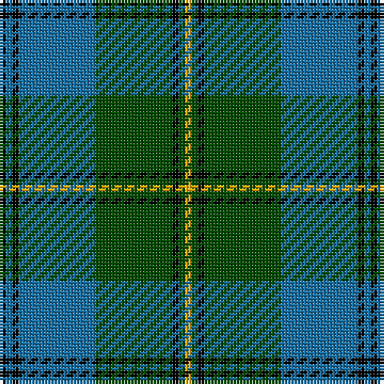

The parent of this is [Banff Centennial](/tartans/k/2/ba2/k2/ba24/g24/k2/g2/y/2/)

This was sourced from register-of-tartans.  It is a [8 stripes tartan](/stripes/stripes8/).

Original link https://www.tartanregister.gov.uk/tartanDetails.aspx?ref=5081

## Thread count
K/2 Ba2 K2 Ba24 G24 K2 G2 Y/2

## Palette
Each colour and its ΔE from the base-6 reference it is a variant of.

| Colour | Shade | Base | ΔE (OKLab) |
|---|---|---|---|
| B |  `#1474B4` | B  | 0.15 |
| Ba |  `#1870A4` | B  | 0.14 |
| DB |  `#00008C` | B  | 0.13 |
| DBa |  `#2C2C80` | B  | 0.05 |
| G |  `#004C00` | G  | 0.08 |
| K |  `#000000` | K  | 0.00 |
| Y |  `#FCB000` | Y  | 0.05 |

# Sample pattern

ID: /variants/k/2/ba2/k2/ba24/g24/k2/g2/y/2-b1474b4-ba1870a4-db00008c-dba2c2c80-g004c00-k000000-yfcb000/
