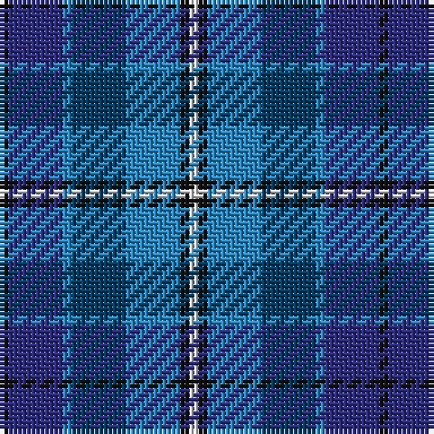

The parent of this is [Mary Washington (Corporate)](/tartans/k/2/db12/b2/dba12/b12/k2/ln/2/)

This was sourced from tartans-authority.  It is a [7 stripes tartan](/stripes/stripes7/).

Original link http://www.tartansauthority.com/tartan-ferret/display/2432/

## Thread count
K/2 DB12 B2 DBa12 B12 K2 LN/2

## Palette
Each colour and its ΔE from the base-6 reference it is a variant of.

| Colour | Shade | Base | ΔE (OKLab) |
|---|---|---|---|
| B |  `#2888C4` | B  | 0.21 |
| DB |  `#2C2C80` | B  | 0.05 |
| DBa |  `#003C64` | B  | 0.07 |
| K |  `#101010` | K  | 0.17 |
| LN |  `#E0E0E0` | W  | 0.06 |

# Sample pattern

ID: /variants/k/2/db12/b2/dba12/b12/k2/ln/2-b2888c4-db2c2c80-dba003c64-k101010-lne0e0e0/
