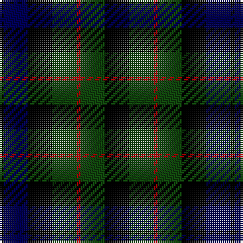

The parent of this is [MacCallum W](/tartans/k/2/db12/k12/dg12/dr2/dg12/k/12/)

This was sourced from weddslist.  It is a [7 stripes tartan](/stripes/stripes7/).

Original link http://www.weddslist.com/cgi-bin/tartans/pg.pl?source=x

## Thread count
K/2 DB12 K12 DG12 DR2 DG12 K/12

## Palette
Each colour and its ΔE from the base-6 reference it is a variant of.

| Colour | Shade | Base | ΔE (OKLab) |
|---|---|---|---|
| DB |  `#000052` | B  | 0.20 |
| DG |  `#11450D` | G  | 0.10 |
| DR |  `#AA0000` | R  | 0.06 |
| K |  `#000000` | K  | 0.00 |

# Sample pattern

ID: /variants/k/2/db12/k12/dg12/dr2/dg12/k/12-db000052-dg11450d-draa0000-k000000/
