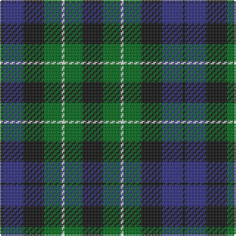

The parent of this is [MacLaggan Artifact Tartan Tartan Number: 1045. Earliest known date: pre 1856 Same as Graham of Montrose. From Baronage of Angus & Mearns 1856. Dalgety Archives say "Family . . . of Glenquiech". Is this Glen Quaich in Perthshire which runs from Amulree up into the hills that lead down to Kenmore on Loch Tay? See products available Copyright © Blair Urquhart, Comrie, 2015](/tartans/k/2/db14/k14/g12/ln2/g12/k/14/)

This was sourced from house-of-tartan.  It is a [7 stripes tartan](/stripes/stripes7/).

Original link http://www.house-of-tartan.scotland.net/house/TartanViewjs.asp?colr=Def&tnam=1045

## Thread count
K/2 DB14 K14 G12 LN2 G12 K/14

## Palette
Each colour and its ΔE from the base-6 reference it is a variant of.

| Colour | Shade | Base | ΔE (OKLab) |
|---|---|---|---|
| DB |  `#2C2C80` | B  | 0.05 |
| G |  `#006818` | G  | 0.02 |
| K |  `#101010` | K  | 0.17 |
| LN |  `#E0E0E0` | W  | 0.06 |

# Sample pattern

ID: /variants/k/2/db14/k14/g12/ln2/g12/k/14-db2c2c80-g006818-k101010-lne0e0e0/
