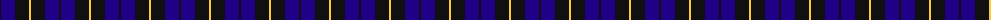
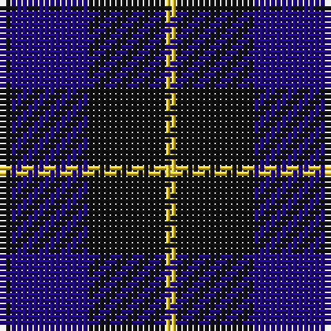

The parent of this is [Wallace (Personal)](/tartans/k/2/db14/k14/y/2/)

This was sourced from tartans-authority.  It is a [4 stripes tartan](/stripes/stripes4/).

Original link http://www.tartansauthority.com/tartan-ferret/display/8125/

## Thread count
K/2 DB14 K14 Y/2

## Palette
Each colour and its ΔE from the base-6 reference it is a variant of.

| Colour | Shade | Base | ΔE (OKLab) |
|---|---|---|---|
| DB |  `#200084` | B  | 0.12 |
| K |  `#101010` | K  | 0.17 |
| Y |  `#FCCC3C` | Y  | 0.05 |

# Sample pattern

ID: /variants/k/2/db14/k14/y/2-db200084-k101010-yfccc3c/
