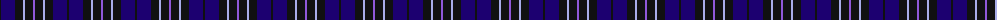
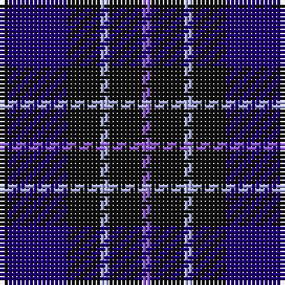

The parent of this is [Scottish Express International (Corp](/tartans/k/2/db14/k8/lp2/k8/p/2/)

This was sourced from tartans-authority.  It is a [6 stripes tartan](/stripes/stripes6/).

Original link http://www.tartansauthority.com/tartan-ferret/display/2309/

## Thread count
K/2 DB14 K8 LP2 K8 P/2

## Palette
Each colour and its ΔE from the base-6 reference it is a variant of.

| Colour | Shade | Base | ΔE (OKLab) |
|---|---|---|---|
| DB |  `#1C0070` | B  | 0.14 |
| K |  `#101010` | K  | 0.17 |
| LP |  `#A8ACE8` | W  | 0.22 |
| P |  `#9058D8` | B  | 0.22 |

# Sample pattern

ID: /variants/k/2/db14/k8/lp2/k8/p/2-db1c0070-k101010-lpa8ace8-p9058d8/
