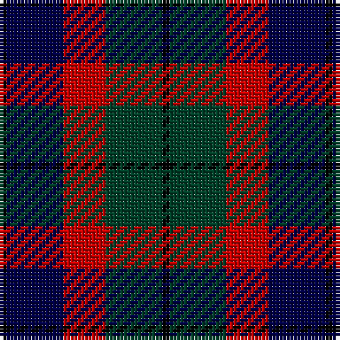

The parent of this is [Edinburgh Military Tattoo 50th Military Tartan Tartan Number: 3614. Earliest known date: 1998 Based on a Wilsons of Bannockburn sett, designed by Peter MacDonald in 1998 for the Edinburgh Military Tattoo to celebrate their 50th anniversary in 2000. The colours depict the three military forces - Navy, Army & Air Force with the black from Edinburgh's heraldic arms. Launched on June 16th 1999 in time for the final Tattoo of the 20th century. See products available Copyright © Blair Urquhart, Comrie, 2015](/tartans/k/2/db16/r12/dg16/k/2/)

This was sourced from house-of-tartan.  It is a [5 stripes tartan](/stripes/stripes5/).

Original link http://www.house-of-tartan.scotland.net/house/TartanViewjs.asp?colr=Def&tnam=3614

## Thread count
K/2 DB16 R12 DG16 K/2

## Palette
Each colour and its ΔE from the base-6 reference it is a variant of.

| Colour | Shade | Base | ΔE (OKLab) |
|---|---|---|---|
| DB |  `#000048` | B  | 0.21 |
| DG |  `#004028` | G  | 0.14 |
| K |  `#000000` | K  | 0.00 |
| R |  `#C80000` | R  | 0.00 |

# Sample pattern

ID: /variants/k/2/db16/r12/dg16/k/2-db000048-dg004028-k000000-rc80000/
