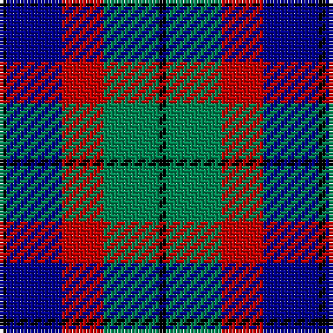

The parent of this is [Edinburgh Tattoo 50th (Commemorative](/tartans/k/2/db16/r12/g16/k/2/)

This was sourced from tartans-authority.  It is a [5 stripes tartan](/stripes/stripes5/).

Original link http://www.tartansauthority.com/tartan-ferret/display/3614/

## Thread count
K/2 DB16 R12 G16 K/2

## Palette
Each colour and its ΔE from the base-6 reference it is a variant of.

| Colour | Shade | Base | ΔE (OKLab) |
|---|---|---|---|
| DB |  `#000090` | B  | 0.13 |
| G |  `#008854` | G  | 0.12 |
| K |  `#000000` | K  | 0.00 |
| R |  `#C80000` | R  | 0.00 |

# Sample pattern

ID: /variants/k/2/db16/r12/g16/k/2-db000090-g008854-k000000-rc80000/
